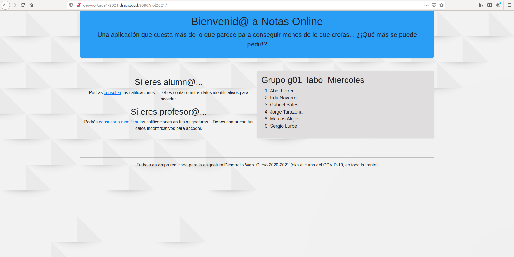
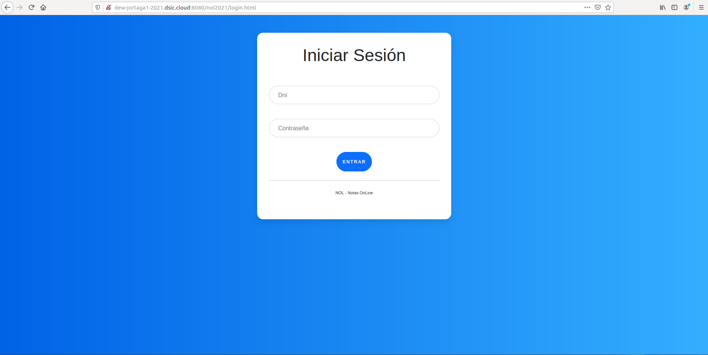
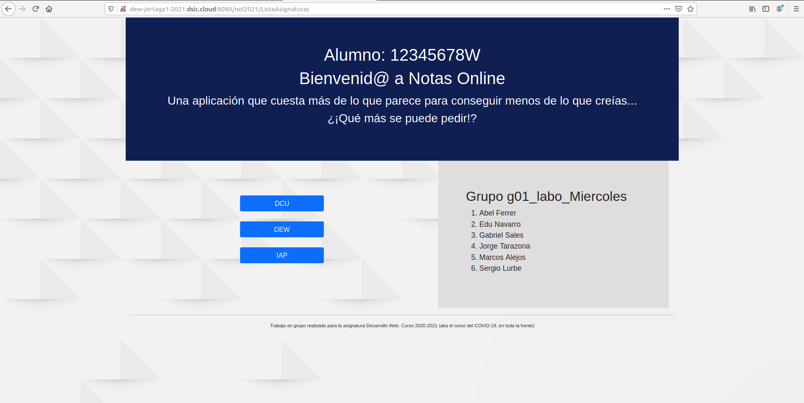
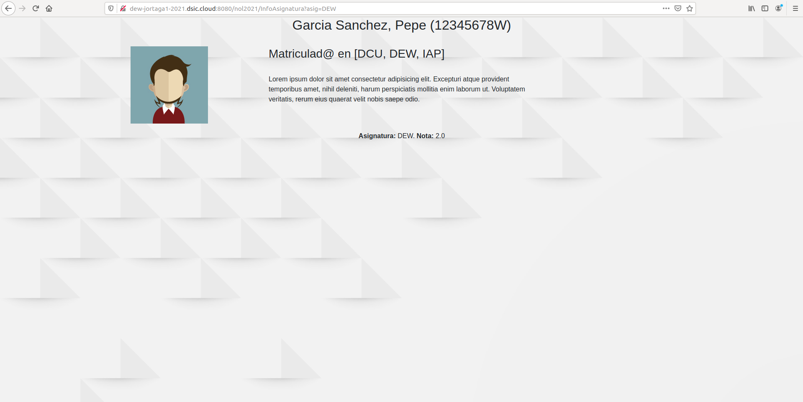
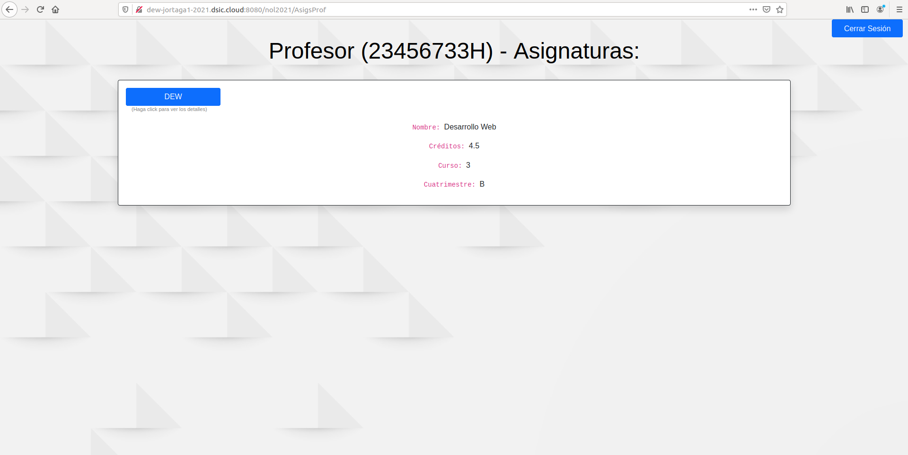
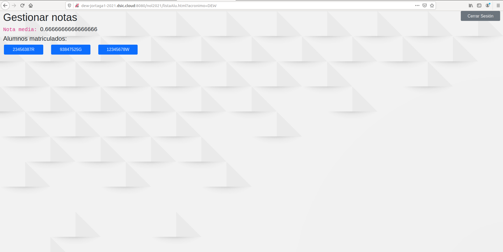
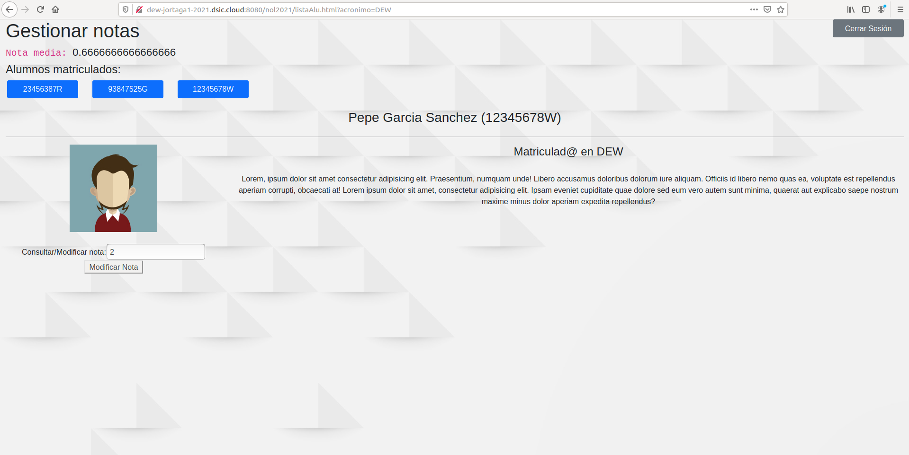

# **Aplicación NOL-2021: Notas Online**

### **Grupo 3TI12-g01**

- Alejos Bermell, Marcos
- Ferrer Juan, Abel
- Lurbe Gorrita, Sergio
- Navarro Chisvert, Eduardo
- Sales Garcia, Gabriel
- Tarazona Gala, Jorge

- - -

## **INDICE**

- ## 1. Introducción
- ## 2. Descripción de la Aplicación
    - ### 1. Ventana Principal
    - ### 2. Ventana Login
    - ### 3. Usuario Alumno
    - ### 4. Usuario Profesor
- ## 3. Elementos de la Aplicación 
    - ### 1. Java (Clases/Servlets)
    - ### 2. HTML
    - ### 3. Hojas de Estilo (CSS)
    - ### 4. Ficheros de Configuración
- ## 4. Interacciones Ajax
- ## 5. Accesos (Logs)
- ## 6. Interfaces gráficas
- ## 7. Anexo -> Actas

- - -

## **1. INTRODUCCION**

Trabajo realizado por el grupo 3TI12-g01, compuesto por Abel Ferrer, Jorge Tarazona, Marcos Alejos, Gabriel Sales, Eduardo Navarro y Sergio Lurbe. 
    
La aplicación web se ha instalado en la máquina virtual: dew-jortaga1-2021.dsic.cloud. La contraseña para acceder al servidor es la inicial (la misma para todas las máquinas, usuario:user, password: resu).

Una vez dentro del servidor la aplicación web se encuentra en el directorio de /tomcat/webapps. Para poner en marcha el servidor accederemos al directorio /tomcat/bin y ejecutamos: ./startup.sh para encender y ./shutdown.sh para apagar. 

Este proyecto, consiste en la creación de una aplicación web que permita consultar, editar y asignar calificaciones de los alumnos. Para ello deberemos de distinguir si el usuario que se autentifica es un profesor o un alumno, para que un alumno no pueda editar/asignar calificaciones. Además, cada alumno no podrá visualizar a otros alumnos, ni un profesor puede asignar notas a alumnos que no pertenezcan a su asignatura. Por todo ello hemos llevado a cabo una aplicación web dinámica, donde aplicamos distintas formas de seguridad para el correcto funcionamiento de la aplicación. Además, hemos implementado el Bootstrap para la construcción de las páginas HTML. Para la realización de algunas operaciones hemos utilizado AJAX para interacciones dinámicas con las páginas HTML y también hemos implementado varios servlets para realizar las peticiones a la API de CentroEducativo.

 ## **2. DESCRIPCION DE LA APLICACION**

La aplicación consta de las siguientes ventanas:

- **1. Ventana Principal**
    
    La primera página que aparece al iniciar la aplicación es la página de bienvenida, donde aparece información referente al grupo de prácticas y los miembros del grupo que han desarrollado la aplicación.

    Desde esta página se accede al login en la aplicación teniendo un enlace para alumnos y otro para profesores, aunque ambos redireccionan a la misma página html, ya que la diferenciación de roles no se realiza hasta que se realiza el proceso de login.

- **2. Ventana Login**

    La página de login es un formulario donde el usuario, tanto si es alumno como profesor, introduce las credenciales de acceso, en este caso `DNI` y `Contraseña`. 

    Una vez introducidas las credenciales el sistema comprueba que sean válidas y se accede a una página similar a la de bienvenida, pero con algunas variaciones dependiendo del rol del usuario.

- **3. Usuario Alumno**

    Una vez se inicia sesión y el sistema reconoce que las credenciales son las de un usuario con el rol de alumno se carga una página principal con Titulo: “**Notas Online:** Asignaturas del/la alumn@ (Nombre Alumn@)”

    Seguidamente se muestra una lista con las asignaturas en las que el usuario este matriculado.
    Al seleccionar una de las asignaturas de la lista aparece una nueva pantalla donde se muestra información general del usuario (nombre, apellidos, dni, etc) e información referente a la asignatura seleccionada, como el acrónimo y la calificación que el/la alumn@ ha obtenido en dicha asignaruta.

- **4. Usuario Profesor**

    Al iniciar sesión, si el sistema reconoce que las credenciales introducidas corresponden a las de un profesor carga una pagina principal de Titulo: “**Notas Online:** Asignaturas del/la Profesor@ (Nombre Profesor@)”. 
    
    A continuación se muestra una lista (enlaces) de las asignaturas que imparte este profesor@.

    Caundo se accede a una de las asignaturas aparece una lista de los alumnos matriculados en la asignatura identificados mediante el DNI. Al acceder a uno de los alumnos se muestra justo a la derecha de la propia pantalla un contenedor con la información del alumno seleccionado, además de unos botones para consultar o modificar las notas de ese alumno en esa asignatura.

## **3. ELEMENTOS DE LA APLICACION**

- **1. Java (Sevlets/Clases)**

    - **Login.java:** Primer Servlet que se crea en la aplicación. Se invoca por una peticion  desde el formulario de la pagina login.html. 

        ```java
        String url = "http://dew-jortaga1-2021.dsic.cloud:9090/CentroEducativo/login";
        URL u = new URL(url);				
                conexion = (HttpURLConnection) u.openConnection();
                conexion.setRequestProperty("Content-Type", "application/json");
                conexion.setRequestMethod("POST");
                conexion.setDoOutput(true);
                conexion.setDoInput(true);
        ```

        La funcion principal de este Servlet es realizar una peticion POST a la API de CentroEducativo con el DNI y Contraseña que recibe el servlet desde el formulario de login.html.
        ```java
        String dni = request.getParameter("dni");
	    String password = request.getParameter("password");
        ```
        Al realizar la petición el sistema responde con una key para identificar la sesión, esta key la guardaremos mediente el uso de Cookies para poder acceder a esa informacion en cualquier momento del uso de la aplicación. Siempre que no cerremos sesión claro esta.

        Ademas de la key tambien almacenaremos el dni del usuario registrado, ya sea profesor o alumno ya que sera necesario disponer de el en otros servlets para realizar peticiones sobre CentroEducativo.

        Otra cuestión importante es la diferenciacion entre alumnos y profesores, para ello hemos diseñado funciones que determinan, a partir del DNI introducido si el usuario tiene rol de profesor o de alumno.

        ```java
        protected boolean checkLoginAlu(String dni)
        protected boolean checkLoginPro(String dni)
        ```
        De manera que si se trata de un alumno accedemos al Servlet ``ListaAsignaturas`` y si por el contrario es un Profesor accedemos a ``AsigsProf``.

    - **ListaAsignaturas.java:** Después de hacer el inicio de sesión, se carga la pagina principal algo diferente para profesores y alumnos. Estas paginas principales se construyen directamente el los servlets. En este caso se contrue la de los alumnos, en el que se muestra la lista de asignaturas a las que esta matriculado el alumno con el que se ha iniciado sesión.

        Para ello hay que realizar una peticion GET de asignaturas a la plataforma de CentroEducativo, indicando el dni del alumno.

        ```java
        String url = "http://dew-jortaga1-2021.dsic.cloud:9090/CentroEducativo/alumnos/" + dni + "/asignaturas?key=" + key;

        URL u = new URL(url);				
			conexion = (HttpURLConnection) u.openConnection();
			conexion.setRequestProperty("Content-Type", "application/json");
			conexion.setRequestMethod("GET");
			conexion.setDoOutput(true);
			conexion.setDoInput(true);
        ```
        Como se observa en el fagmento de código para hacer la petición necesitamos indicar la clave ``key`` obtenida al iniciar sesión. Es por eso que era importante crear una cookie con este valor para que sea facilemte accesible.

        La respuesta en formato JSON con las asignaturas se almacena en un array de tipo Asignatura, una clase que hemos creado dentro del propio servlet:
        
        ```java

        Asignatura[] asigs = gson.fromJson(resultado,Asignatura[].class);

        for(Asignatura a : asigs) {
			
			pw.println("<a class=\"btn btn-primary \" href='/nol2021/InfoAsignatura?asig=" + a.asignatura + "' role=\"button\" style=\"display:block;width:200px\"" + "'>" + a.asignatura + "</a><br/>");
		}

        ```
        Para cada asignatura que obtenemos de la respuesta creamos un enlace HTML con destino ``InfoAsignatura``, otro servlet donde veremos los detalles del alumno en la asignatura.
        A este Servlet le pasamos el acronimo de la asignatura como parámetro por motivos que veremos en la expliación del servlet.
        

    - **AsigsProf.java:** En este servlet, de manera similar a como ocurre para los usuarios con rol de alumno, se muestra una lista de las asignaturas, en este caso, que imparte el profesor que ha iniciado sesión. 

    La generacion de la pagina se realiza directamente desde el servlet. Mostrando la página de inicio con Titulo: “**Notas Online:** Asignaturas del/la Profesor@ (Nombre Profesor@)”. 
    Y debajo la lista de asignaturas. Para ello se realiza una peticion ``GET`` a CentroEducativo mediante el dni del profesor y la clave de sesión recibida al hacer el login.

    ```java
    String url = "http://dew-jortaga1-2021.dsic.cloud:9090/CentroEducativo/profesores/" + dni + "/asignaturas?key=" + key;

    URL u = new URL(url);				
			conexion = (HttpURLConnection) u.openConnection();
			conexion.setRequestProperty("Content-Type", "application/json");
			conexion.setRequestMethod("GET");
			conexion.setDoOutput(true);
			conexion.setDoInput(true);
    ```

    Para cada asignatura recibida, de manera análoga a como hemos explicado en el rol usuario, se crea un enlace que te dirige, en este caso, a una pagina html, la diferencia es que esta vez mostrará los alumnos que estan matriculados en dicha asignatura.
    
    ```java
    pw.println("<a class=\"btn btn-primary\" href='listaAlu.html?acronimo=" + a.acronimo + "' role=\"button\" style=\"width:200px\" '>" + a.acronimo + "</a>");
    ```
    Como se puede observar en la siguiente linea al seleccionar el enlace de la asignatura se redirige a ``listaAlu.html`` y se le pasa como parámetro el valor del acrónimo de la asignatura que sera necesario posteriormente.


    - **InfoAsignatura:** Pese al nombre que tiene el servlet, realemnte se detalla la información del alumno dentro de una asignatura, la que hemos seleccionado previamente.

        Este servlet conecta con CentroEducativo mediante una petición ``GET`` para obtener los datos de un alumno mediante su DNI:

        ```java
        String url = "http://dew-jortaga1-2021.dsic.cloud:9090/CentroEducativo/alumnos/" + dni + "?key=" + key;

        URL u = new URL(url);				
			conexion = (HttpURLConnection) u.openConnection();
			conexion.setRequestProperty("Content-Type", "application/json");
			conexion.setRequestMethod("GET");
			conexion.setDoOutput(true);
			conexion.setDoInput(true);
        ```
        La respuesta se almacena en una variable de tipo Alumno, una clase creada dentro del propio Servlet, donde almacenamos la información correspondiente a la respuesta (nombre, apellidos, dni).
        
        La pagina generada se crea directamente desde el servlet, que ademas de mostrar información sobre el alumno mustra información respecto a la nota que el alumno ha obtenido en esa asignatura. En el caso de que todavia no haya recibido nota se mostrara un mensaje de "Por calificar".

        Como hemos visto en el Servlet anterior, la peticion para obterner detalles de asignatura es la misma. Solo que se debe filtrar la respuesta para obtener solo la información de la asignartura que hayamos elegido en la lista, el filtrado se realiza mediante el acronimo de la asignatura.

        ```java
        String asigAmostrar = request.getParameter("asig");

                .
                .
                .

        if(asigs[i].asignatura.equals(asigAmostrar))
        ```
        Está es la ultima pantalla a la que se puede acceder como usuario del rol de alumno, ya que sus operaciones son solamente de consulta de notas sobre asignaturas.

    - **GetAlus.java:** Este servlet se invoca mediante una perticon Ajax desde el metodo GET, pasandole el acrónimo de la asignatura seleccionada como parámetro usamos tambien la funcion ``getParameter("acronimo")``.

        Una vez tenemos este valor ya podemos efectuar la peticion a CentroEducativo para obtener la lista de alumnos matriculados en dicha asignatura.

        ```java
        String url = "http://dew-jortaga1-2021.dsic.cloud:9090/CentroEducativo/asignaturas/" + acronimo + "/alumnos?key=" + key;
        URL u = new URL(url);				
			conexion = (HttpURLConnection) u.openConnection();
			conexion.setRequestProperty("Content-Type", "application/json");
			conexion.setRequestMethod("GET");
			conexion.setDoOutput(true);
			conexion.setDoInput(true);
        ```
        Guardamos la respuesta que recibe el servlet en fomrato JSON y la enviamos de nuevo al ajax para que trabaje con ella y complete la pagina html con los datos obtenidos.

        ```java
        response.setContentType("application/json");
		response.setCharacterEncoding("UTF-8");
        ```

    - **GetInfoAlu.java:**

        ```java
        String alumno = request.getParameter("alu");

            .
            .
            .

        String url = "http://dew-jortaga1-2021.dsic.cloud:9090/CentroEducativo/asignaturas/" + acronimo + "/alumnos?key=" + key;
        URL u = new URL(url);				
			conexion = (HttpURLConnection) u.openConnection();
			conexion.setRequestProperty("Content-Type", "application/json");
			conexion.setRequestMethod("GET");
			conexion.setDoOutput(true);
			conexion.setDoInput(true);
        ```

        Este servler obtiene el dni del alumno seleccionado desde la petición ajax realizada previamente.
        
        Una vez obtenido este valor, se realiza la peticion GET a CentroEducativo para obtener la informacion del alumno que posteriormente se envia con formato ``JSON`` a ``listaAlu.html``, desde la peticion ajax:

        ```java
        String json = gson.toJson(resultado);
		
		response.setContentType("application/json");
		response.setCharacterEncoding("UTF-8");
		
		PrintWriter pw = response.getWriter();
		
		pw.print(json);
        ````

    - **ModificarNota.java:** Este servlet realiza una peticion PUT para la modificacion de la nota de un alumno en una asignatura determinada:
        
        ```java
        String acronimo = (String) request.getParameter("acronimo");
		String alumno = request.getParameter("alumno");
		String nota = request.getParameter("nota");
		
    	String urlaux = "http://dew-jortaga1-2021.dsic.cloud:9090/CentroEducativo/alumnos/" + alumno + "/asignaturas/" + acronimo + "?key=" + key;

 		try {
    	URL url = new URL(urlaux);
    	HttpURLConnection conexion = null;
    	conexion = (HttpURLConnection) url.openConnection();
		conexion.setRequestProperty("Content-Type", "application/json");
		//conexion.setRequestProperty("Accept", "application/json");
		conexion.setRequestMethod("PUT");
		conexion.setDoOutput(true);
		conexion.setDoInput(true);
        ```

- **2. HTML**

    - **index.html:** Página inicial de la aplicación, la primera a la que accedemos nada mas entrar en la aplicación. Es de acceso anónimo, ya que no requiere un inicio de sesion previo para acceder. 
    El diseño de la pagina esta realizado mediante Bootstrap y la estructura no es demasiado compleja, sin elementos a destacar, la cabecera tipica de html y un cuerpo con algunos encabezados, una lista con los participantes del grupo y algun contenedor mas con algo de texto. Para el acceso al login hay dos enlaces para acceso como profesor o alumno.

    - **login.html:** Ventana de Lgin donde el usuario inicia la sesión. Tambien es una página sencilla y sin demasiada complicación. Lo mas destacable es el formulario para el inicio de sesión que comunica con el servlet ``Login`` mediante una petición ``POST``.

        Los valores introducidos se validan en el sistema al iniciar el servlet mediante el archivo de tomacat ``tomcat-users.xml`` el cual detallaremos mas adelante en el apartado de "Archivos de Configuración".

        ```html
            <input type="text" id="inputEmail" name="dni" class="form-control" placeholder="Dni" required>

            <input type="password" id="inputPassword" name="password" class="form-control" placeholder="Contraseña" required>
        ```
        A cada uno de los inputs les asignamos un ``name`` para poder acceder al valor que se introduce dentro del input en el Servlet.

        Respecto al estilo de la pagina mayormente esta deseñada mediante el uso de Bootstrap aunque también hemos añadido una hoja de estilos CSS (login.css) que comentaremos en el apartado de "Hojas de estilo CSS".  

    - **listaAlu.html:** En esta página HTML se mostrarán los alumnos que estan matriculados en la asignatura seleccionada previamente. Para ello usamos tecnologia Ajax para la comunicación con un servlet, en este caso ``GetAlus`` mediante el método ``GET``.

        ```javascript
        $.ajax({
			type: 'GET',
			url: 'GetAlus?acronimo=' + acr,
			contentType: "application/json",
			dataType : 'json',
        ```
        Así quedaria la petición Ajax. La respuesta y como manejamos los datos los veremos en el apartado de "INTERACCIONES AJAX".

        Por otra parte cuando recibe la lista de alumnos del servlet y la procesa. Crea mediante la funcion ``rellenar(alumno, nota)``un contenedor donde se miestran los detalles del alumno a partir del alumno seleccionado de la lista. Calculando tambien su nota media y pudiendo modificar sus calificaciones en esa asignatura mediante otra petición Ajax a otro servlet ``GetInfoAlu`` pasandole como parámetro el dni del alumno seleccionado:

        ```javascript
        $.ajax({
			type: 'GET',
			url: 'GetInfoAlu?alu=' + alumno,
			contentType: "application/json",
			dataType : 'json',
			success: function(data){
        ```
        La respuesta se detallará en el apartado de "INTERACCIONES AJAX".

        Tambien dispone de una función ModificarnNota que realiza la conexion con un servlet que realiza una peticion PUT a CentroEducativo para modificar la nota de un alumno en una asignatura.

        
        ```javascript
        $.ajax({ 
				type: 'PUT', 
				url: 'ModificarNota?acronimo=' + acr + '&alumno=' + dni + '&nota=' + notaFinal,
				contentType: 'application/json',
				data: {acronimo: acr, alumno: dni, nota: notaFinal},
	        	success: function(data){
	        		alert("Nota actualizada correctamente");
	        	}
			}); 
        ```

          

- **3. Hojas de Estilo CSS**

    - **login.css:** Diseño de la ventana de ``login.html``. Poco que destacar de este archivo.

        Recalcar el uso de una fuente importada de Google Fonts (Noto Serif JP), el color de fondo de la pantalla y de la creacion de un contenedor central donde se encuentra el formulario para el Inicio de Sesión.

- **4. Ficheros de Configuración**


## **4. INTERACCIONES AJAX**

En cuanto a las interacciones agiles, hemos escogido desarrollar servlets que realizan peticiones muy concretas a CentroEducativo, mientras que las peticiones Ajax se limitan a contactar con el servlet intermediario que devuelve objetos `JSON`.

A modo de ejemplo se muestran un servet que hace una petición a `CentroEducativo` y una petición **AJAX** a éste servet y el tratamiento de la respuesta que implica operaciones con jquery y el cálculo de la nota media.

```javascript
$(document).ready(function(){
	 
		var parameters = location.search.substring(1).split("&");

    	var temp = parameters[0].split("=");
    	acr = unescape(temp[1]);
    
    	var key = getCookie("key");   	
    	   	
		$.ajax({
			type: 'GET',
			url: 'GetAlus?acronimo=' + acr,
			contentType: "application/json",
			//data: {acronimo: acr},
			dataType : 'json',
			success: function(data){
				
				datax = JSON.parse(data);
				
				var notamedia = 0;				
				
				var i = 0;
				
				$.each(datax, function(index, elemento){					
					
					var aux = parseInt(elemento.nota) || 0;	
					
					$("#dnis").append("<a class='btn btn-primary' role='button' style='width:150px;margin-left:15px;margin-right:15px;' onclick=\"rellenar('" + elemento.alumno + "','" + aux + "');\">" + elemento.alumno + "</a>");		
										
					notamedia += aux;
					
					i = i + 1;					
				});
				
				notamedia = notamedia/i;
				
				$("#nmedia").append("<code>Nota media: </code>" + notamedia);		
				
			},
			error: function(e) { console.log(e); }
		});
	});
```

La petición ajax realiza una peticion tipo `GET` al Servlet **GetAlus** incluyendo el parámetro del acrónimo de la asignatura a consultar. Se especifica el tipo de datos de la respuesta como `json`, pero dentro de la función success se realiza un `JSON.parse` para convertir el JSON recibido en un objeto manipulable.

    A continuación se muestra el servlet que realiza la peticion a `CentroEducativo` y devuelve la respuesta en formato JSON.

```java
String acronimo = request.getParameter("acronimo");
		
		Cookie[] cookies = request.getCookies();
		String key = "";
		
		for(Cookie c : cookies) {
			if(c.getName().equals("key")) {
				key = c.getValue();
			}
		}
				      
		String url = "http://dew-jortaga1-2021.dsic.cloud:9090/CentroEducativo/asignaturas/" + acronimo + "/alumnos?key=" + key;
		
		BufferedReader reader = null;
		HttpURLConnection conexion = null;
		StringBuffer buffer = new StringBuffer();
		
		try { //recoger info de alumno
			
			URL u = new URL(url);				
			conexion = (HttpURLConnection) u.openConnection();
			conexion.setRequestProperty("Content-Type", "application/json");
			conexion.setRequestMethod("GET");
			conexion.setDoOutput(true);
			conexion.setDoInput(true);
			
			String salida = null;
			reader = new BufferedReader(new InputStreamReader(conexion.getInputStream(), "utf-8"));
			
			while((salida = reader.readLine()) != null) {
				
				buffer.append(salida);
				
			}
			
		}
		catch( MalformedURLException e ) { e.printStackTrace(); }
		catch( IOException e ) { e.printStackTrace(); }
		
		finally {
				if(reader != null){
					try { 
							reader.close(); 
						}
					catch( IOException e ) { e.printStackTrace(); }
				}
				if(conexion != null) { 
						conexion.disconnect();
						}
		}
		
		String resultado = buffer.toString();
		
		Gson gson = new Gson();
		
		String json = gson.toJson(resultado);
		
		response.setContentType("application/json");
		response.setCharacterEncoding("UTF-8");
		
		PrintWriter pw = response.getWriter();
		
		pw.print(json);
		pw.flush();
		
```

## **5. ACCESOS (LOGS)**

Para tener un control sobre los accesos a los servlets se ha desarrollado un servlet especifico que guarda cada log en un fichero `txt` en el directorio `/home/user/tomcat/bin/logNOL.txt` con la información de cuando, quién, desde dónde y a qué servlet ha accedido.

Primero, en el fichero de despliegue `web.xml` se han añadido las siguientes líneas que permiten establecer que servlets monitorizará el filtro.

```xml
<filter-mapping>
    <filter-name>Log</filter-name>
    <url-pattern>/Log</url-pattern>
    <url-pattern>/DetallesAsignatura</url-pattern>
    <url-pattern>/ListaAsignaturas</url-pattern>
    <url-pattern>/Login</url-pattern>
    <url-pattern>/InfoAsignatura</url-pattern>
    <url-pattern>/AsigsProf</url-pattern>
    <url-pattern>/CerrarSesion</url-pattern>
    <url-pattern>/GetInfoAlu</url-pattern>
    <url-pattern>/ModificarNota</url-pattern>
</filter-mapping>
```

En cuanto al código java, destacar que es una implementación muy similar a la desarrollada en el Hito 1. Destacar primero la creacion de los objeros httpservletrequest y httpservletresponse, para acceder a las cookies y los métodos que proporcionan la información que necesitamos almacenar, luego la creación del archivo y la escritura de la información pertinente, y finalmente, la redireccion del filtro para continuar con la ejecucion normal de los servlets.

```java
        HttpServletRequest httpServletRequest = (HttpServletRequest) request;
		HttpServletResponse httpServletResponse = (HttpServletResponse) response;

        LocalDateTime fecha = LocalDateTime.now();
		
		FileWriter writer = null;
		BufferedWriter out = null;
		String user = null;
		
		try {
			
			File file = new File("/home/user/tomcat/bin/logNOL.txt");
			if(!file.exists()){  // Comprobar si existe el archivo en cuestión.
			   file.createNewFile(); // Crear el archivo.
			}
			writer = new FileWriter(file.getAbsolutePath(), true);
			out = new BufferedWriter(writer);
			
			String dni = "";
			
			Cookie[] cookies = httpServletRequest.getCookies();
			if (cookies != null){
				for(Cookie c : cookies) {
					if(c.getName().equals("dni")) {
						user = c.getValue();
					}
				}
			}else {
				user = "No Disponible";
			}	
			
			out.write(fecha.toString() + " " +  user + " " + httpServletRequest.getRemoteAddr() + " " + httpServletRequest.getServletPath().substring(1) + " acceso " +httpServletRequest.getMethod() + "\n");
			
		}catch(IOException e) {
			
		}finally {
	        try {	    
	            if (out != null)
	                out.close();
	            if (writer != null)
	                writer.close();
	        } catch (IOException ex) {
	            ex.printStackTrace();
	        }
	        
		}
		// pass the request along the filter chain
		chain.doFilter(httpServletRequest, httpServletResponse);

```
## **6. INTERFACES GRÁFICAS

Para entrar a la aplicación, se puede hacer indicando en la url solamente el proyecto, como en la foto a continuación, o bien mediante el archivo `ìndex.html`. En ésta pagina podemos elegir si autenticarnos como profesor o alumno mediante el link en azul.



Una vez entrado en la autenticación aparece la siguiente ventana, que permite introducir nuestras credenciales.



     6.1 EJEMPLO ALUMNO

A continuacion se muestra la interfaz del alumno(el alumno 12345678W en este caso) con todas las asignaturas en las que está matriculado, para acceder se debe clickar en una asignatura.



Dentro de una asignatura (DEW), se pueden visualizar los detalles.



    6.2 EJEMPLO PROFESOR

Una vez logeado como profesor (23456733H en este caso), aparecerá una lista detallada de cada asignatura que imparte. Para poder ver más detalles se dispone de un botón dedicado para cada asignatura.



Una vez pulsado un boton de una asignatura, la aplicación nos redirige a la siguiente página que visualiza todos los alumnos por dni en los que imparte docencia junto a la nota media total entre todos estos. Se ha considerado como nota no disponible un valor de 0 sobre 10.



Seleccionando un dni de un alumno (12345678W en este caso) se visualizan los detalles del alumno junto a un apartado que permite modificar su nota. Este apartado solo acepta notas mayores o iguales que 0 y menores o iguales a 10.




## **7. ANEXO -> ACTAS SESIONES**

### HITO 1

# *REC Hito 1 DEW 2021 - Grupo TI12-g01*

#### Grupo formado por:
* Abel Ferrer Juan
* Jorge Tarazona Gala
* Marcos Alejos Bermell
* Sergio Lurbe Gorrita
* Gabriel Sales García
* Eduardo Navarro Chisvert

\
&nbsp;
\
&nbsp;

## **ÍNDICE**


* *** REC HITO 1*** -
\
&nbsp;

1. Primeros servlets: varios prototipos incrementales de log, puestos a prueba
con un formulario.
    * ~~Log0 -> devuelve texto con informaciones relevantes (datos del
formulario, información del cliente, fecha actual, URI, método)~~
    * **Log1 -> una copia del resultado se debe almacenar en un fichero con
nombre y ruta preestablecidos. Estudiar el problema de acceso a
ficheros locales fuera del espacio web del servidor.**
    * **Log2 -> configurar la ruta del archivo mediante web.xml**
2. Información adicional

\
&nbsp;
**1. Primeros servlets: varios prototipos incrementales de log, puestos a prueba
con un formulario.**

Para facilitar el testeo de cada implementación se ha creado un sencillo documento `index.html` que contiene 3 formularios, uno para cada versión de *log*, formados por un *input* de tipo *texto* que tiene como objetivo introducir tu nombre de usuario y un *botón* de tipo *sumbit* que se encarga de ejecutar el `servlet` correspondiente.

    -> LOG 1

Esta versión introduce un paso extra respecto a la version inicial `Log0`, la creación de un fichero `.txt` que almacene la informacion de cada log. Debemos tener en cuenta que nuestro servlet se ejecuta en el lado del servidor por lo que la creación de archivos se realiza en este entorno, en concreto en la ruta `/home/user/tomcat/bin` en la máquina de *portal* que ejecuta el servidor, como se muestra a continuación: 

```java
        LocalDateTime fecha = LocalDateTime.now();
		
		PrintWriter html = response.getWriter();
		
		File file = new File("/home/user/tomcat/bin/log1.txt");
		if(!file.exists()){  // Comprobar si existe el archivo en cuestión.
		   file.createNewFile(); // Crear el archivo.
		}
		FileWriter writer = new FileWriter("/home/user/tomcat/bin/log1.txt", true);
		BufferedWriter out = new BufferedWriter(writer);
		String user;
		
		try {
			user = request.getParameter("user1"); 
			
			html.println("<html><head><title>Log1</title></head>");
			html.println("<body><p>" + "Log creado correctamente en el directorio " + file.getAbsolutePath());
			html.println("</p></body></html>");
			
			if(user == null) {user="Usuario no disponible";}
			
			out.write(fecha.toString() + " " +  user + " " + request.getRemoteAddr() + " " + request.getServletPath().substring(1) + " " +request.getMethod() + "\n");
			
		}catch(IOException e) {
			e.printStackTrace();
		}finally {
	        try {	    
	            if (out != null)
	                out.close();
	            if (writer != null)
	                writer.close();
	        } catch (IOException ex) {
	            ex.printStackTrace();
	        }
	        
		
```

Para evitar intentar acceder a un archivo inexistente, es conveniente realizar una comprobación del archivo, para crearlo en caso de no encontrarlo. A continuación se encapsula en un objeto `BufferedWriter` para realizar la escritura de toda la información relevante para el almacenamiento del *log*. Una vez guardada la información y cargado el código `html` de respuesta, es **imprescindible** **cerrar** ambos objetos responsables de la escritura en archivo, `FileWriter` y `BufferedWriter`, para evitar generar excepciones en el código.
\
&nbsp;

    -> LOG 2

Ésta version nuevaménte es idéntica a la anterior, `log 1`, excepto en un aspecto, en este caso la ruta del archivo `txt` se vuelve **dinámica** al convertirse en una variable dentro del archivo `web.xml`. A continuación se muestra el código de dicha implemetacion de `log 2` junto a una explicación de los cambios realizados a nivel de código `java` y a nivel del archivo `web.xml`.

```java
        ServletConfig config=getServletConfig();  
	    String ruta = config.getInitParameter("ruta");  
	   
		LocalDateTime fecha = LocalDateTime.now();
		
		PrintWriter html = response.getWriter();
		
		File file = new File(ruta);
		if(!file.exists()){  // Comprobar si existe el archivo en cuestión.
		   file.createNewFile(); // Crear el archivo.
		}
		FileWriter writer = new FileWriter(ruta, true);
		BufferedWriter out = new BufferedWriter(writer);
		String user;
		
		try {
			user = request.getParameter("user2");			
			
			html.println("<html><head><title>Log2</title></head>");
			html.println("<body><p>" + "Log creado correctamente en el directorio " + file.getAbsolutePath() + " mediante el acceso a web.xml");
			html.println("</p></body></html>");
			
			if(user == null) {user="Usuario no disponible";}
			
			out.write(fecha.toString() + " " +  user + " " + request.getRemoteAddr() + " " + request.getServletPath().substring(1) + " " +request.getMethod() + "\n");
			
		}catch(IOException e) {
			user = "";
		}finally {
	        try {	    
	            if (out != null)
	                out.close();
	            if (writer != null)
	                writer.close();
	        } catch (IOException ex) {
	            ex.printStackTrace();
	        }
	        
		}
```

Respecto a `log 1`, los cambios introducidos en el *servlet* se basan en crear un objeto `ServletConfig` que nos permitirá acceder al **parámetro** que introduciremos en `web.xml`, explicado a continuación, permitiendo así especificar **una única vez** la ruta que desearemos utilizar para realizar el guardado del log en fichero.

No obstante, respecto a las modificaciones en el descriptor `web.xml` también son sencillas. Primero especificamos el dentro de la etiqueta `init-param` dos valores que corresponden al par de valores `nombre:clave`. El primero, `param-name` indicará el nombre asignado a la "variable" que queremos introducir. Ésta "variable" está definida dentro de la etiqueta `param-value`, que contiene el valor de la "variable", en nuestro caso, la ruta del archivo `log2.txt`. Gracias a estas modificaciones la especificación del directorio solamente se encuentra ajena al código java, dando lugar a una implementacion más modular y dinámica.

```xml
<init-param>  
    <param-name>ruta</param-name>  
    <param-value>/home/user/tomcat/bin/log2.txt</param-value>  
</init-param> 
```
\
&nbsp;

**2. Información adicional**

Para la realización de la recuperación de la **Sesión 1** nos hemos reunido 4/6 miembros el día 21/5 a las 17:30 mediante la plataforma Teams.  

 -Marcos Alejo no ha podido asistir por incompatibilidad horaria por motivos laborales.

-Gabriel Sales no ha podido asistir por motivos desconocidos.


### HITO 2

# *Acta 2 DEW 2021 - Grupo TI12-g01*

#### Grupo formado por:
* Abel Ferrer Juan
* Jorge Tarazona Gala
* Marcos Alejos Bermell
* Sergio Lurbe Gorrita
* Gabriel Sales García
* Eduardo Navarro Chisvert

\
&nbsp;
\
&nbsp;

## **ÍNDICE**


* **Sesión 1**
    1. Exploración de la API de nivel de datos mediante el plugin RESTED sobre Firefox
    2. Cómo interaccionar por programa mediante bibliotecas JSON y REST
    3. Estudio de sesiones en los niveles de lógica y de datos
    4. Adición automatizada mediante curl (asignaturas, profesores y alumnos)
    5. Autenticación web
\
&nbsp;
* **Sesión 2**
    1. Escenario de consulta por una alumna
    2. Escenario de profesor que califica y consulta el resultado
    3. Esquema global de navegación
\
&nbsp;
* **Detalles**
    1. Detalles extras    

\
&nbsp;   

## ***SESIÓN 1***

\
&nbsp; 
    
    1. Exploración de la API de nivel de datos mediante el plugin RESTED sobre Firefox

Para lograr este objetivo primero deberemos añadir el complemento (plugin) `RESTED` al navegador Firefox accediendo a la pestaña "Complementos" del menú "hamburguesa" e introduciendo `RESTED` en la barra de búsqueda. Una vez instalado, para hacer uso de las funcionalidades que nos brinda el plugin es necesario ejecutar en la maquina virtual de portal el archivo `es.upv.etsinf.ti.centroeducativo-0.2.0.jar` mediante la orden ``java -jar es.upv.etsinf.ti.centroeducativo-0.2.0.jar`` desde la linea de terminal.

Una vez inicializado CentroEducativo, es hora de realizar peticiones utizando el plugin `RESTED`. Hemos realizado una operación de "Login" para comprobar el funcionamiento. Para ello seleccionamos el método `POST` e introducimos como URL la direccion en la hemos ejecutado CentroEducativo, es decir, la maquina virtual de portal, ``http://dew-jortaga1-2021.dsic.cloud:9090/CentroEducativo/login``. Para loggearnos en CentroEducativo necesitamos proporcionar nuestro *dni* y *contraseña*. Para esto, añadimos en el menú desplegable "Headers" la cabecera `Content-Type` en el campo *name* con valor (*value*) `application/json`. A continuación, en el menú desplegable "Request body" introducimos el tipo JSON y hacemos click en *Add-Paremeter* para introducir los dos valores. Primero introducimos `dni` en el campo *name* y su valor en el campo *value*, por ejemplo `111111111` (administrador). Para la contraseña los pasos son análogos al dni, en la siguiente fila introducimos `password` en el campo *name* y a continuacion en el campo *value* el valor de la contraseña, que en este caso es `654321`.

Una vez rellenados todos los campos necesarios para realizar la petición a CentroEducativo la enviamos pulsando en el botón **Send Request**. Al realizarse correctamente la petición recibimos un `código HTTP 200` junto a la **KEY** generada en el proceso de *login*. En caso de error, recibiriamos un `código HTTP 400`. 
\
&nbsp; 
 
    2. Cómo interaccionar por programa mediante bibliotecas JSON y REST

En este apartado aboradaremos el problema desarrollando un *servlet* que accede a un servicio `REST`, en concreto `TheCatAPI`. Previamente hemos seleccionado **GSON** como biblioteca para el tratamiento de objetos Json. Para incorporar esta biblioteca a nuestro proyecto son necesarios varios pasos. Primero es indispensable realizar un **IMPORT** en el código java como se muestra a continuación:

```java
import com.google.gson.Gson;
```
A continuación, descargamos la version de **GSON** en formato *jar*, en nuestro caso hemos escogido la version 2.6.2. Una vez tenemos el archivo descargado, lo copiamos a la carpeta `WebContent/WEB-INF/lib` del proyecto. También hemos añadido el *.jar* al "Build-Path" del proyecto. Una vez añadida correctamente la librería ya podemos interactuar con el servicio REST `TheCatAPI` mediante un servlet.

```java
import java.io.BufferedReader;
import java.io.IOException;
import java.io.InputStreamReader;
import java.io.PrintWriter;
import java.net.HttpURLConnection;
import java.net.URL;

import javax.servlet.ServletException;
import javax.servlet.annotation.WebServlet;
import javax.servlet.http.HttpServlet;
import javax.servlet.http.HttpServletRequest;
import javax.servlet.http.HttpServletResponse;

import com.google.gson.Gson;

/**
 * Servlet implementation class Gatos2
 */
@WebServlet("/Gatos2")

public class Gatos2 extends HttpServlet {

	public class CatData { // Estructura de las entradas en el objeto JSON de respuesta
	      public Object[] breeds;
	      public Category[] categories;
	      public String id;
	      public String url;
	      public int width;
	      public int height;
	    }

	    public class Category {
	      public int id;
	      public String name;
	    }
	
	private static final long serialVersionUID = 1L;
    private static final Gson gson = new Gson();
    private static final String catURL = "https://api.thecatapi.com/v1/images/search";
    private static final String preface = "<!DOCTYPE html>\n<html lang=\"es\">\n" +
      "<head>\n<meta charset=\"utf-8\" />\n" +
      "<meta http-equiv=\"Content-Type\" content=\"text/html\" />\n" +
      "<title>Mi Gato</title>\n</head>\n<body>\n" +
      "<h1>Foto de un gato</h1>\n<h2>Recarga para ver otros...</h2>";
	
    /**
     * @see HttpServlet#HttpServlet()
     */
    public Gatos2() {
        super();
        // TODO Auto-generated constructor stub
    }

	/**
	 * @see HttpServlet#doGet(HttpServletRequest request, HttpServletResponse response)
	 */
	protected void doGet(HttpServletRequest request, HttpServletResponse response) throws ServletException, IOException {
		
		  CatData[] cat;
	      PrintWriter out = response.getWriter();    
	      response.setContentType("text/html");
	      try {
	      
	        URL urlas = new URL(catURL);
	        HttpURLConnection con2 = (HttpURLConnection) urlas.openConnection();
	      
	        con2.setDoOutput(true);
	        con2.setRequestMethod("GET"); // Sin variables de formulario ni otras informaciones extra
	        con2.setRequestProperty("accept","*/*");
	      
	        try(BufferedReader br = new BufferedReader(
	            new InputStreamReader(con2.getInputStream(), "utf-8"))) {
	              String response3 = "";
	              String responseLine = null;
	              while ((responseLine = br.readLine()) != null) {
	                response3 += responseLine.trim();
	              }            
	              cat = gson.fromJson(response3, CatData[].class);
	            }
	        } catch(Exception e) {
	            response.sendError(500, "Hubo problemas al recuperar la información." + e);
	            return;
	        }
	        if (cat != null) {
	          out.println(preface);
	          out.println("<div></div>");
	          out.println("</body></html>");
	        }
		
	}

	/**
	 * @see HttpServlet#doPost(HttpServletRequest request, HttpServletResponse response)
	 */
	protected void doPost(HttpServletRequest request, HttpServletResponse response) throws ServletException, IOException {
		// TODO Auto-generated method stub
		doGet(request, response);
	}

}

```
\
&nbsp; 


    3. Estudio de sesiones en los niveles de lógica y de datos   

El concepto de **Sesión** respecto al nivel de lógica y datos no deben ser confundidos. Para conseguir que nuestro *Servlet* contacte con el nivel de datos, es necesario poder obtener los valores de los atributos *dni*, *contraseña* y *key*.

Sería necesario disponer de un atributo `session` para acceder a los atributos, los métodos `web.auth()` y `data.auth()` y un vector `users[]` que relaciones ambos métodos. Con todos los requesitos nombrados podemos utilizar el siguiente *pseudocodigo* al comienzo del *servlet*.

```java
if (!sesion.key) {
    if (login = web.auth()) { // usando getRemoteUser()
        sesion.dni = users[login].dni;
        sesion.pass = users[login].password;
        if (key = data.auth(sesion.dni, sesion.pass)) { // invocando /login por POST
            sesion.key = key;
        }
        else { error("data.auth");
        }
    else { error("web.auth");
    }
}
```

\
&nbsp; 

    4. Adición automatizada mediante curl (asignaturas, profesores y alumnos)

En la sesión anterior abordamos las peticiones mediante `curl` mediante terminal. En este caso, para lograr automatizar las peticiones de adición `curl` hemos optado por desarrollar un script que primero inice sesión como *rol administrador*, guarde la **KEY** asociada al inicio de sesión y posteriormente realize las peticiones para añadir tanto alumnos, asignaturas y profesores.

A fin de demostración solo hemos añadido un objeto de cada tipo pero es interesante el hecho de poder replicar las operaciones para añadir una gran cantidad de informacion en *CentroEducativo*, ya que éste no implementa `persistencia` por lo que cada vez que apagasemos *CentroEducativo* todas las operaciones de añadir alumnos/profesores/asignaturas realizadas no tendrían efecto permanente en la apliación. A continuación mostramos el script `adicioncurl.sh` que hemos desarrollado:

```bash
#!/bin/bash

Key=$(curl -s --data '{"dni":"111111111","password":"654321"}' \ -X POST -H "content-type: application/json" http://dew-jortaga1-2021.dsic.cloud:9090/CentroEducativo/login \ -c cucu -b cucu)

curl -X POST "http://dew-jortaga1-2021.dsic.cloud:9090/CentroEducativo/asignaturas?key=$Key" -H "accept: text/plain" -H "Content-Type: application/json" -d "{  \"acronimo\": \"A1\",  \"creditos\": 5,  \"cuatrimestre\": \"A\",  \"curso\": 1,  \"nombre\": \"Asig1\"}" -c cucu -b cucu

curl -X POST "http://dew-jortaga1-2021.dsic.cloud:9090/CentroEducativo/alumnos?key=$Key" -H "accept: text/plain" -H "Content-Type: application/json" -d "{  \"apellidos\": \"Matata\",  \"dni\": \"13579A\",  \"nombre\": \"Akuna\",  \"password\": \"123456\"}" -c cucu -b cucu

curl -X POST "http://dew-jortaga1-2021.dsic.cloud:9090/CentroEducativo/profesores?key=$Key" -H "accept: text/plain" -H "Content-Type: application/json" -d "{  \"apellidos\": \"Iglesias\",  \"dni\": \"9876543P\",  \"nombre\": \"Pablo\",  \"password\": \"123456\"}" -c cucu -b cucu
```

Para comprobar las operaciones de adición hemos realizado peticiones `GET` a **CentroEducativo** para listar todas las asignaturas, profesores y alumnos.
\
&nbsp; 

    5. Autenticación web

Para autenticarnos hemos creado un proyecto de pruebas para explorar las posibilidades de autenticación. Finalmente, hemos elegido utilizar el método de autentificacion `BASIC`. Para lograr nuestro objetivo es necesario realizar unas modificaciones.

Primeramente, será necesario espeficicar en el archivo `tomcat-users.xml` de nuestro servidor los roles que necesitamos y también que usuarios pertenecen a cada rol, como se describe a continuación.

```xml
    <role rolename="rolalu"/>
    <role rolename="rolpro"/>
 
    <user username="12435687A" password="123456" roles="rolpro"/>
    <user username="10101010C" password="123456" roles="rolpro"/>
    <user username="01010101B" password="123456" roles="rolpro"/>
 
    <user username="12345678P" password="123456" roles="rolalu"/>
    <user username="23443211L" password="123456" roles="rolalu"/>
    <user username="34534534V" password="123456" roles="rolalu"/>
    <user username="45645667Z" password="123456" roles="rolalu"/>
```

Por último, debemos añadir al descriptor del proyecto `web.xml` las siguientes lineas que indican el recurso que deseamos proteger (`index.html`), los roles que estan autorizados (`rolpro`) y el tipo de autentificacion a implementar (`BASIC`).

```xml
<security-constraint>
		<web-resource-collection>
			<web-resource-name>
				index.html
			</web-resource-name>
			<url-pattern>
				/*
			</url-pattern>
		</web-resource-collection>
		<auth-constraint>
			<role-name>rolpro</role-name>			
		</auth-constraint>
</security-constraint>
<login-config>
		<auth-method>BASIC</auth-method>
		<realm-name>Protegido</realm-name>
</login-config>
```

Una vez configurados los ingredientes, al acceder al recurso `index.html` nos aparece una ventana emergente que nos pide identificarnos y solo nos dejará acceder si nos identificamos si el *dni* y *contraseña* pertenecen a rolpro y éstos aparecen en *tomcat-users.xml*. No obstante, esta opción no nos parece muy escalable ya que se vuelve muy tediosa de controlar aunque es interesante para aplicar conceptos.
\
&nbsp; 
## ***SESIÓN 2***
\
&nbsp; 

    1. Escenario de consulta por una alumna


Para desarrollar el entorno de la aplicación `NOL-NotasOnline` hemos desarrollado varios archivos *html* y varios servlets utilizando como servidor la máquina `dew-jortaga1-2021.dsic.cloud`. La página principal, `index.html` premite acceder al login clickando en el texto resaltado en azul. Al clickar, redirige la pagina al servlet `Login` que realiza el inicio de sesión contactando con *CentroEducativo*. A continuación se muestra el código de dicho servlet. Para el envío de datos en formato `Json` hemos decidido usar la biblioteca `GSON`. No hemos conseguido extraer la `key` que devuelve *CentroEducativo* al realizar el login, por lo que no hemos podido continuar con el resto de objetivos.

```java
import java.io.BufferedReader;
import java.io.IOException;
import java.io.InputStream;
import java.io.InputStreamReader;
import java.io.OutputStream;
import java.io.PrintWriter;
import java.net.CookieHandler;
import java.net.CookieManager;
import java.net.CookiePolicy;
import java.net.HttpURLConnection;
import java.net.MalformedURLException;
import java.net.URL;
import java.nio.charset.StandardCharsets;
import java.time.LocalDateTime;
import java.util.stream.Collectors;

import javax.servlet.ServletException;
import javax.servlet.annotation.WebServlet;
import javax.servlet.http.Cookie;
import javax.servlet.http.HttpServlet;
import javax.servlet.http.HttpServletRequest;
import javax.servlet.http.HttpServletResponse;
import javax.servlet.http.HttpSession;

import org.apache.tomcat.util.http.fileupload.IOUtils;

import com.google.gson.Gson;
import com.google.gson.JsonObject;

//import org.json.simple.JSONObject;
/**
 * Servlet implementation class Login
 */
@WebServlet("/Login")
public class Login extends HttpServlet {
	private static final long serialVersionUID = 1L;
       
    /**
     * @see HttpServlet#HttpServlet()
     */
    public Login() {
        super();
        // TODO Auto-generated constructor stub
    }

    public class Usuario{
    	
    	public String dni;
    	public String password;
    	
    	public Usuario(String dni, String password) {
    		this.dni = dni;
    		this.password = password;
    	}

    }
    
	/**
	 * @see HttpServlet#doGet(HttpServletRequest request, HttpServletResponse response)
	 */
	protected void doGet(HttpServletRequest request, HttpServletResponse response) throws ServletException, IOException {
		// TODO Auto-generated method stub
		//response.getWriter().append("Served at: ").append(request.getContextPath());

	}

	/**
	 * @see HttpServlet#doPost(HttpServletRequest request, HttpServletResponse response)
	 */
	protected void doPost(HttpServletRequest request, HttpServletResponse response) throws ServletException, IOException {
		// TODO Auto-generated method stub
		//doGet(request, response);
		
		String dni = request.getParameter("dni");
		String password = request.getParameter("password");

		HttpSession sesion = request.getSession();


        String url = "http://dew-jortaga1-2021.dsic.cloud:9090/CentroEducativo/login";
		//String jsoncutre = "{ \"dni\":\""+ dni + "\",  \"password\":\"" + password + "\" }";
        
		Gson gson = new Gson();
		Usuario usuario = new Usuario(dni, password);
		String enviar = gson.toJson(usuario);
		
		BufferedReader reader = null;
		HttpURLConnection conexion = null;
		StringBuffer buffer = new StringBuffer();
		
		CookieManager cookieManager = new CookieManager(null, CookiePolicy.ACCEPT_ALL);
		CookieHandler.setDefault(cookieManager);
		
		try {
			
			URL u = new URL(url);				
			conexion = (HttpURLConnection) u.openConnection();
			conexion.setRequestProperty("Content-Type", "application/json");
			conexion.setRequestProperty("Accept", "application/json");
			conexion.setRequestMethod("POST");
			conexion.setDoOutput(true);
			conexion.setDoInput(true);
			
			OutputStream stream = conexion.getOutputStream();
			stream.write(enviar.getBytes("UTF-8"));
			stream.close();
			
			String salida = null;
			reader = new BufferedReader(new InputStreamReader(conexion.getInputStream(), "utf-8"));
			
			while((salida = reader.readLine()) != null) {
				
				buffer.append(salida);
				
			}
			
		}
		catch( MalformedURLException e ) { e.printStackTrace(); }
		catch( IOException e ) { e.printStackTrace(); }
		
		finally {
				if(reader != null){
					try { 
							reader.close(); 
						}
					catch( IOException e ) { e.printStackTrace(); }
				}
				if(conexion != null) { 
						conexion.disconnect();
						}
		}
	
		String cookies = cookieManager.getCookieStore().getCookies().toString();
		String result[] =  { buffer.toString() , cookies};
		
		Cookie cookie = new Cookie("key", result[0]);

		response.addCookie(cookie);
	
		
		
		if(!buffer.toString().equals("-1")) {
			if(request.isUserInRole("rolalu")) {
				
				response.sendRedirect("/Hito2/ListaAsignaturas");
			}
			if(request.isUserInRole("rolpro")) {
				
				response.sendRedirect("/Hito2/ListaAsignaturas");
			}
		}
		
	}
	
}
```

## ***DETALLES***

Para realizar los objetivos hemos escogido como herramienta de comunicación Teams. Acordamos reunirnos los días Viernes 7 a las 17:30, Sábado 15 a las 18:00, Domingo 16 a las 17:00, Lunes 17 a las 17:30 y Martes 18 a las 17:00.


- ### **Sesión 3:**

        Fecha: 16/05/2021
        Participantes: Jorge Tarazona, Abel Ferrer, Gabriel Sales, Sergio Lurbe, Eduardo Navarro, Marcos Alejos

        - Escenario de consulta de la alumna:

        Como primer objetivo tenemos la consulta de una alumna, para ello deberemos de realizar un página login en la cual el/la alumn@ inicie sesión y comprobar si existe y si la contraseña enviada es la correcta. Para ello debemos de comprobarlo con JSON y distintos métodos para acceder a la API de CentroEducativo. 
        Tras la comprobación se abrirá una nueva página, con la información de las asignaturas a la que el/la alumn@ pertenece , cada asignatura tiene asignado unos detalles que se mostrarán en la página de cada asignatura (en nuestro caso aún no hemos implementado las Cards de Bootstrap por lo que no se muestra nada).

        - Escenario de profesor que califica y consulta el resultado

        En este caso, un profesor inicia sesión en el login, en este caso será parecido al anterior, puesto que mostrará las asignaturas que el profesor imparte. Todos los datos que puedan aparecer en esta página serán tratados desde los métodos que se dan en la API de CentroEducativo. 
        El objetivo de este apartado es el que un profesor pueda visualizar sus asignaturas acceder a ellas y consultar los alumnos matriculados en las asignaturas que imparte y después de "clickar" en el alumno, se muestre la información del alumno en la asignatura elegida.

- ### **Sesión 4:**
        Fecha:20/05/2021 
        Participantes: Jorge Tarazona, Abel Ferrer, Gabriel Sales, Sergio Lurbe, Eduardo Navarro, Marcos Alejos.

        En esta sesión hemos tratado de aprender como utilizar AJAX para realizar un buen uso en la aplicación. Además en esta sesión hemos terminado con el servlet del listado de asignaturas que teníamos pendiente de la sesión 3(debíamos revisar un par de errores y solucionarlos). Además durante la sesión se ha hablado de cual sería la estrategia a desarrollar con los demás servlets, a parte de eso también se ha comenzado con la parte 
        de AJAX de algunos HTML.

- ### **Sesión 5:**
        23/05/2021
        Participantes: Jorge Tarazona, Abel Ferrer, Gabriel Sales, Sergio Lurbe, Eduardo Navarro, Marcos Alejos.

        Pasados un par de días hemos vuelto a reunirnos para terminar de configurar el servlet del listado de alumnos de la asignatura desde el punto de vista del profesor, que nos estaba dando problemas debido a no saber como configurar los alumnos que salían, etc. Finalmente, hemos conseguido finalizar satisfactoriamente este servlet, y creemos que su funcionamiento es correcto por lo que se ha dispuesto a programar otra parte de la aplicación como es la consulta y modificación de las notas por parte del profesor. En este caso hemos comenzado con la parte de AJAX.

- ### **Sesión 6:**
        29/05/2021
        Participantes: Jorge Tarazona, Abel Ferrer, Gabriel Sales, Sergio Lurbe, Eduardo Navarro, Marcos Alejos. 

        En la sesión anterior, se terminó la parte de AJAX, en esta sesión nos pondremos a terminar de programar el servlet para que la modificación de la nota sea correcta y que se guarde la información para la consulta del alumno. Hemos tenido que tratar un par de problemas que han surgido como la no-modificación de notas en el servidor. Lo que nos ha hecho que la reunión se alargue algo más del par de horas. Tras ello, hemos conseguido que funcionase bien.
    
- ### **Sesión 7:**
        05/06/2021
        Participantes: Jorge Tarazona, Abel Ferrer, Gabriel Sales, Sergio Lurbe, Eduardo Navarro, Marcos Alejos.

        Tras tomarnos casi una semana de descanso(debíamos por exámenes de otras asiganturas como de esta), hemos retomado el trabajo con más ganas que nunca, hemos resuelto los errores que se nos han dictado en la corrección del hito 2. Al terminar, hemos vuelto a los errores de la consulta de un alumno a sus notas. En este caso, hemos resuelto todas las dudas de todos los compañeros y los problemas que nos surgían en el servlet. 

- ### **Sesión 8:**
        09/06/2021
        Participantes: Jorge Tarazona, Abel Ferrer, Gabriel Sales, Sergio Lurbe, Eduardo Navarro, Marcos Alejos.

        En esta sesión hemos comenzado con la memoria del proyecto, durante la sesión nos hemos divido el trabajo para facilitar y reducir el tiempo de realización de la memoria. Se han recogido todas las actas que teníamos y se han realizado las capturas a la parte del código.

- ### **Sesión 9:**
        11/06/2021
        Participantes: Jorge Tarazona, Abel Ferrer, Gabriel Sales, Sergio Lurbe, Eduardo Navarro, Marcos Alejos.

        Durante la sesión hemos terminado de redactar la memoria y hemos resuelto las dudas finales sobre el trabajo que tenían algunos compañeros. Esta sesión ha sido la final, por lo que hemos decidido despedirnos y desearnos lo mejor en el futuro.


